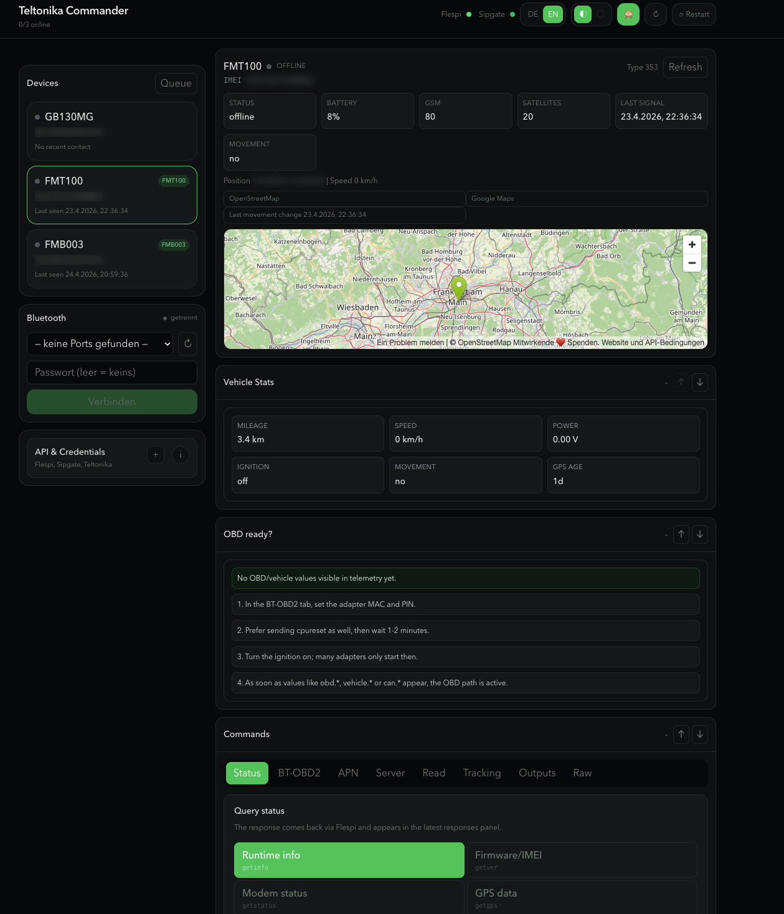

# Teltonika Commander

[](https://github.com/kpma1985/teltonika-commander/releases)
[](LICENSE)

A web UI for sending GPRS and SMS commands to **Teltonika FMT/FMB trackers** via [Flespi](https://flespi.io) and [Sipgate](https://www.sipgate.de).

Install initial configuration (APN, server, BT-OBD2) onto devices over the air — without physical access.



---

## Features

- **GPRS commands** via Flespi Codec-12 — instant delivery, response included
- **SMS fallback** via Sipgate — for initial setup before APN is configured
- **Presets** for APN, server, BT-OBD2, tracking intervals, I/O outputs, status queries
- **Command history** with execution status per device
- **PWA** — installable on iPhone and Android as a home screen app
- **Dark & light theme**, German and English UI
- **Home Assistant Add-on** — runs directly on your Hassio instance

---

## Installation

### Home Assistant Add-on

[](https://my.home-assistant.io/redirect/supervisor_add_addon_repository/?repository_url=https%3A%2F%2Fgithub.com%2Fkpma1985%2Fteltonika-commander)

Or manually:
1. **Settings → Add-ons → Add-on Store → ⋮ → Repositories**
2. Add: `https://github.com/kpma1985/teltonika-commander`
3. Install **Teltonika Commander** and enter your Flespi token in the add-on options

### Docker

```bash
cp .env.example .env
# fill in your tokens
docker compose --env-file .env -f docker/docker-compose.yml up -d --build
```

Then open `http://localhost:3001`.

### Local development

```bash
bun install
cp .env.example .env
# fill in your tokens
bun run dev        # server :3001 + web :5173
```

Open `http://localhost:5173`.

---

## Configuration

Copy `.env.example` to `.env` and fill in the values:

| Variable | Description |
|---|---|
| `FLESPI_TOKEN` | Flespi API token — [get one here](https://flespi.io/panel/#/tokens) |
| `SIPGATE_TOKEN_ID` | Sipgate PAT token ID (e.g. `token-XXXXXX`) |
| `SIPGATE_TOKEN` | Sipgate PAT token |
| `TELTONIKA_SMS_LOGIN` | SMS auth login set on the device (leave empty if not set) |
| `TELTONIKA_SMS_PASSWORD` | SMS auth password set on the device |

SMS via Sipgate is optional — leave all `SIPGATE_*` variables empty to disable it.

---

## Presets

| Preset | Command generated |
|---|---|
| **BT-OBD2** | `setparam 800:1;807:2;804:<MAC>;806:<PIN>` |
| **APN** | `setparam 2001:<APN>;2002:<user>;2003:<pass>;2016:<auth>` |
| **Server** | `setparam 2000:1;2004:<domain>;2005:<port>;2006:<proto>` |
| **Settings read** | `getparam` for APN, server or network profile |
| **Status** | `getinfo`, `getver`, `getstatus`, `getgps`, `battery`, `readio` |
| **Outputs** | `setdigout <states> <timers> <speed thresholds>` |
| **Tracking** | `setparam 10000/10005/10050/10055:<interval>` |
| **Raw** | any custom command |

Parameter IDs: [Teltonika FMT100 Parameter list](https://wiki.teltonika-gps.com/view/FMT100_Parameter_list)

---

## Architecture

```
root
├─ server/          Hono + Bun + SQLite
│  ├─ flespi.ts     Device list, telemetry, command queue
│  ├─ sipgate.ts    OAuth (PKCE) + PAT Basic Auth
│  ├─ commands.ts   Preset → Teltonika command string
│  ├─ db.ts         Command log, Sipgate auth, OAuth state
│  └─ index.ts      API routes
└─ web/             React + Vite + Tailwind + PWA
   └─ src/
      ├─ components/presets/   One form per preset
      └─ api.ts                Typed API client
```

---

## Security

- `.env` and `data/` (SQLite with refresh tokens) are gitignored — never commit them
- All API tokens stay on the server — the frontend never sees them
- If a token leaks: rotate it in the Flespi or Sipgate console

---

## References

- [FMT100 SMS/GPRS Commands](https://wiki.teltonika-gps.com/view/FMT100_SMS/GPRS_Commands)
- [FMT100 Bluetooth Settings](https://wiki.teltonika-gps.com/view/FMT100_Bluetooth_settings)
- [FMT100 Parameter List](https://wiki.teltonika-gps.com/view/FMT100_Parameter_list)
- [Flespi Commands API](https://flespi.com/kb/commands-api)
- [Sipgate REST API — SMS](https://www.sipgate.io/rest-api/sms)

---

## License

MIT
